#Custom-Gravity-Physics-Unity
 Welcome! This is an Open Source Unity project created by me, ThermiteFe8/Nicole, that supports custom gravity fields that can point in ANY direction and manipulate the player in many ways, somewhat inspired by Super Mario Galaxy and JasperRLZ's video about [Galaxy's Physics]([https://youtu.be/b_rjBWmc1iQ?si=Y2uWjdvnZttxyt79](https://youtu.be/QLH_0T_xv3I?si=RQEIPpAtLrjodIQP))! It includes spheres, parallel fields, and splline fields, along with QOL stuff such as drop shadows that point in the direction of gravity, transparencies, and camera triggers. The code should be adequately documented/commented, but I'll explain how to use this below and roughly how it works

##Gravity Physics Basics
 The Custom Gravity Affected script is what makes this work - the gravity fields detect it and then update the Falling Direction Vector arbitrarily. If there are multiple gravitational fields affecting the player, then the Priority field lets you define which field should take over.
 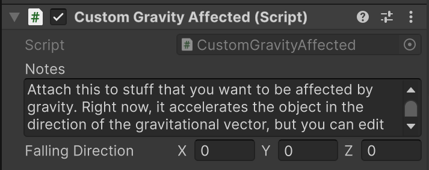

###Parallel Gravity Field
 The most straightforward one - it just points the Falling Direction Vector in one direction. You can set the values of this vector yourself. It's useful for wall-running or just flipping the player upside-down. 
 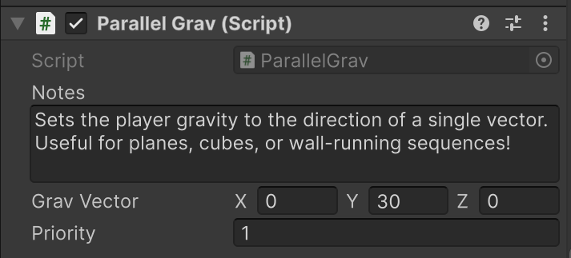
 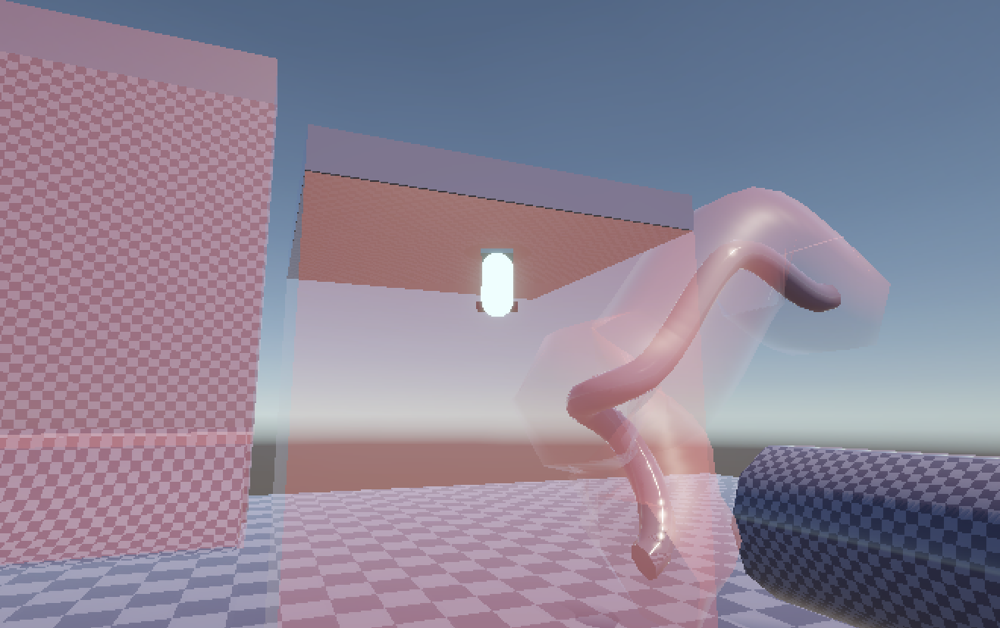

###Sphere Gravity Field
 This one pulls the player towards a central point. Ideal for your most basic kinds of planets! By default, it uses the transform of the Game Object it's attached to as the center, but you can adjust this using the given Offset vector
 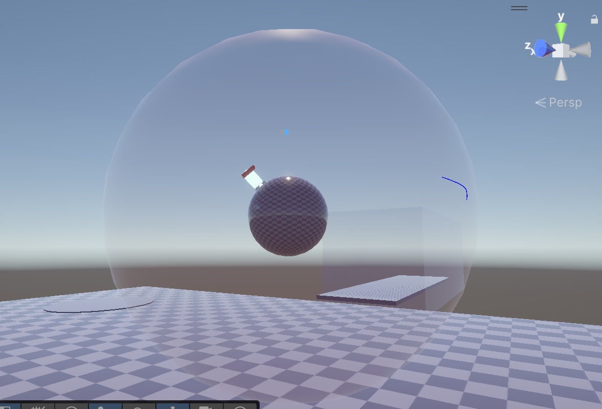
 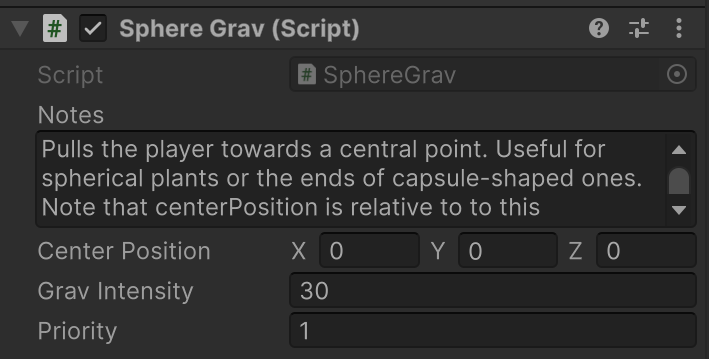

###Spline Gravity Field
 Using a spline drawn out with Unity's Spline package, the player gets pulled towards the closest point on the Spline. 
 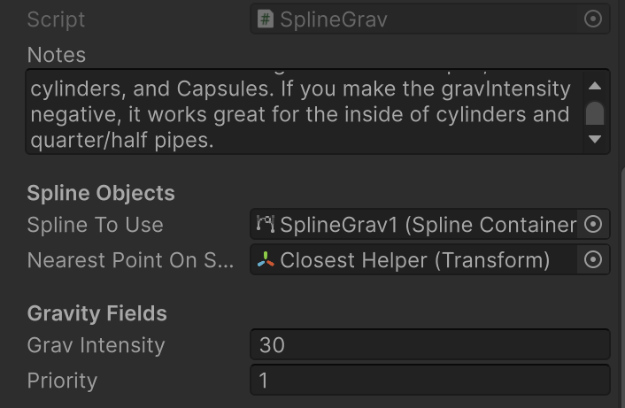
 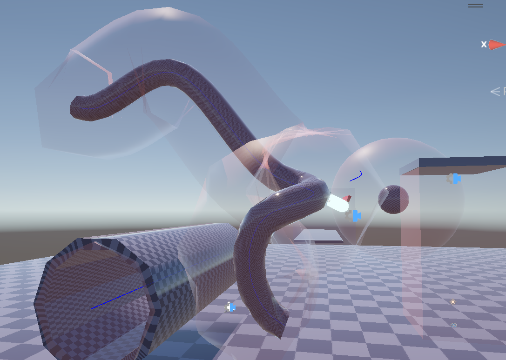
 You can use this to make essentially anything you want, in conjunction with the parallel/sphere fields. Inverting the gravity lets you make the fields of the inside off a cylinder. Limiting it and combining it with the parallel field lets you make a half-pipe, for example.
 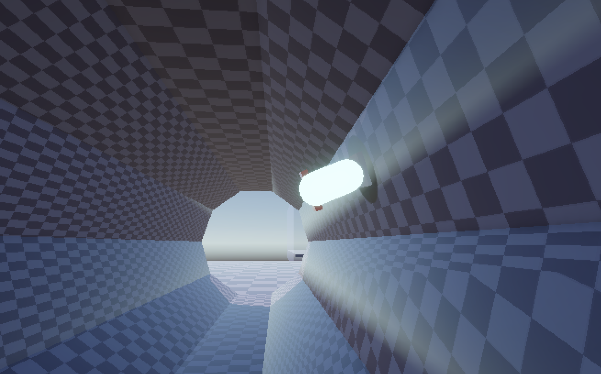
 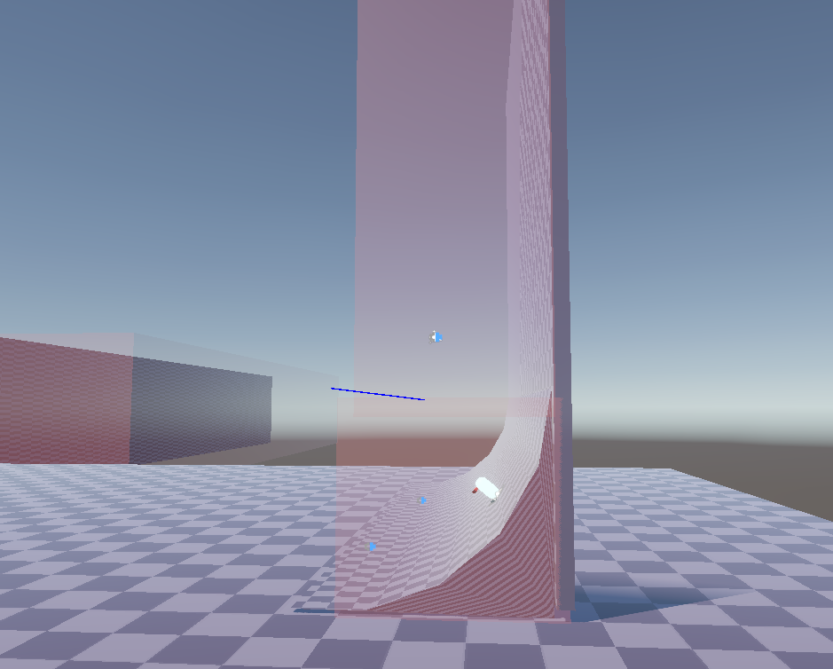

##Camera Triggers and Overrides
 The camera itself just uses Cinemachine. I didn't even make the compilations of componenets - I just took them from the samples. I did, however, make it so that the camera triggers can send data to the player to override their controls. Left/rights get confused when the player gets flipped upside-down for example, so overriding the player's left/right by flipping it can help keep things consistent. By setting the left vector and forward vector to the same axis, you can lock the player's movement in 2D. 
 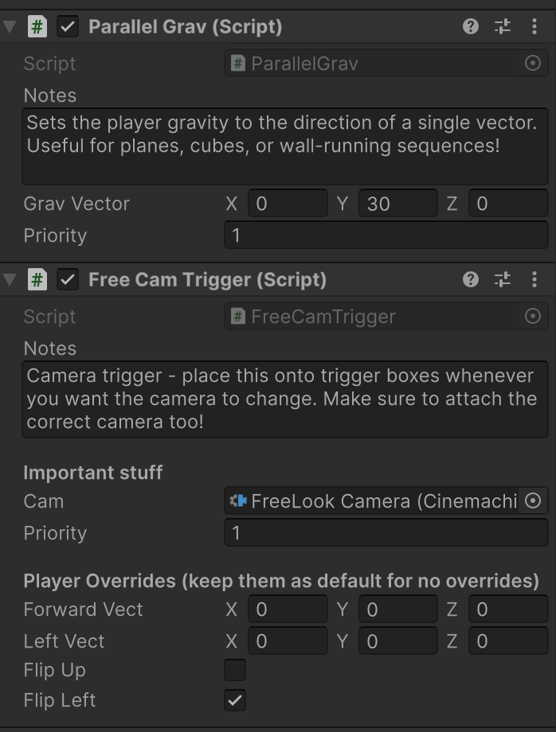
 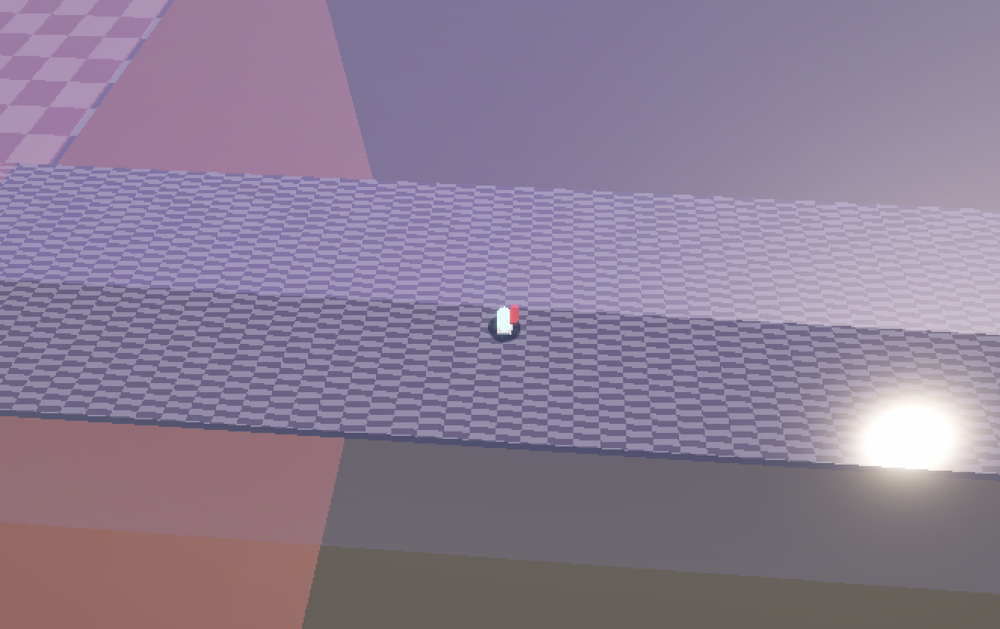

##Visual QOL/Polish
 Drop shadows are useful in platformers - they help tell the player where they're gonna land. Having it obey the light sources only serves to confuse the player. Therefore, I've created a drop-shadow script that uses the Falling Direction of the player to figure out where to draw the Shadow. It just uses the URP Decal Projector and a downward Raycast. I've also made it so that the size/opacity can change depending on the distance to the ground, but this might be GPU intensive, so it's optional.
 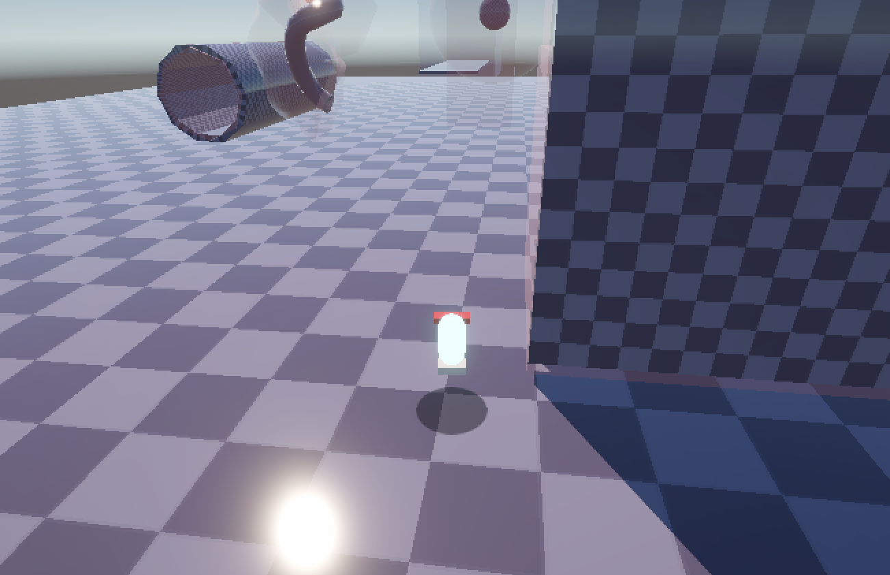
 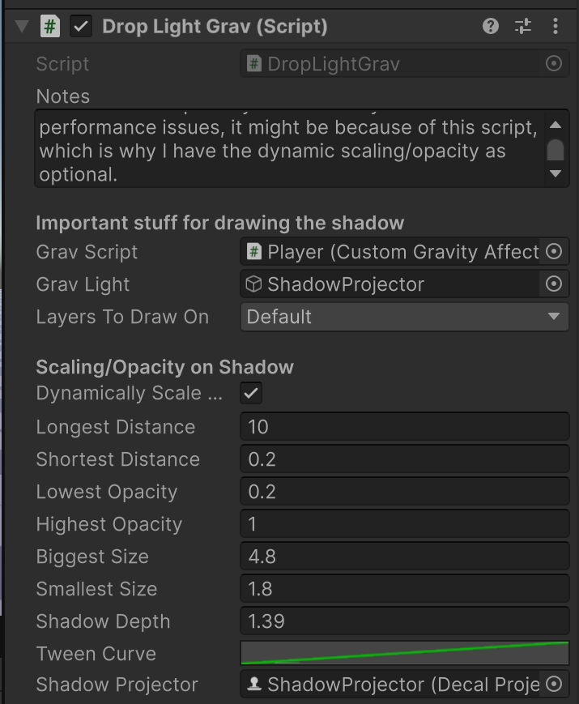

 Given how crazy the camera angles can get when you're playing with Gravity, sometimes obstacles end up blocking the camera. Cinemachine does have collision detection, but the movements can get jarring and the new angles it picks are sometimes even less helpful. So I have a simple script that figures out if anything's between the player and the camera and makes that object transparent, so long as it has the MakeTransparent script attached. Note that the transparent material needs to be transparent by default. The shift is jarring, but there are plenty of creative/artistic ways to handle it, so I'll leave that up to you!
  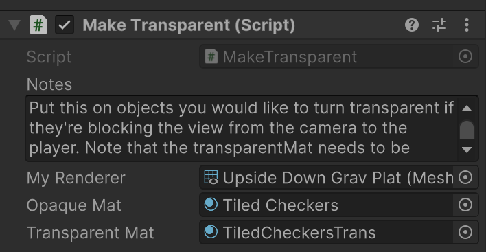
  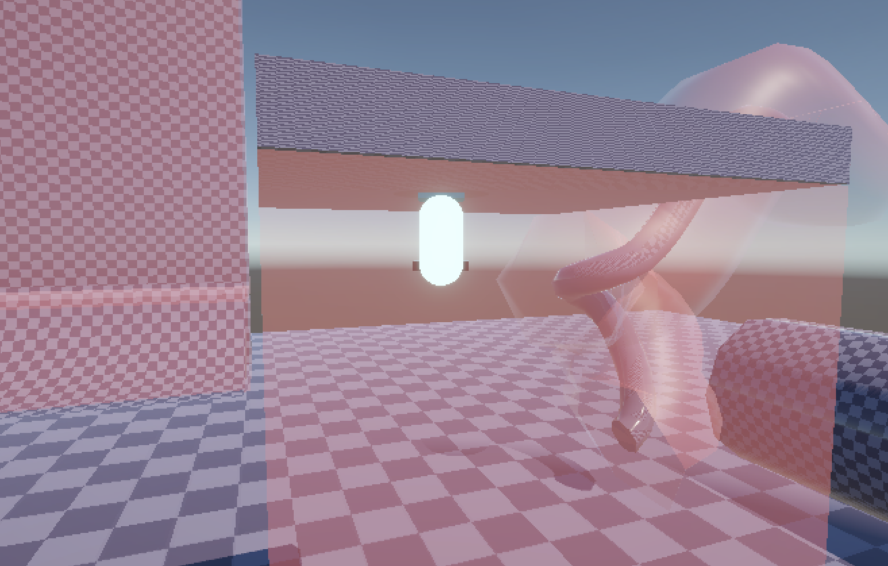
  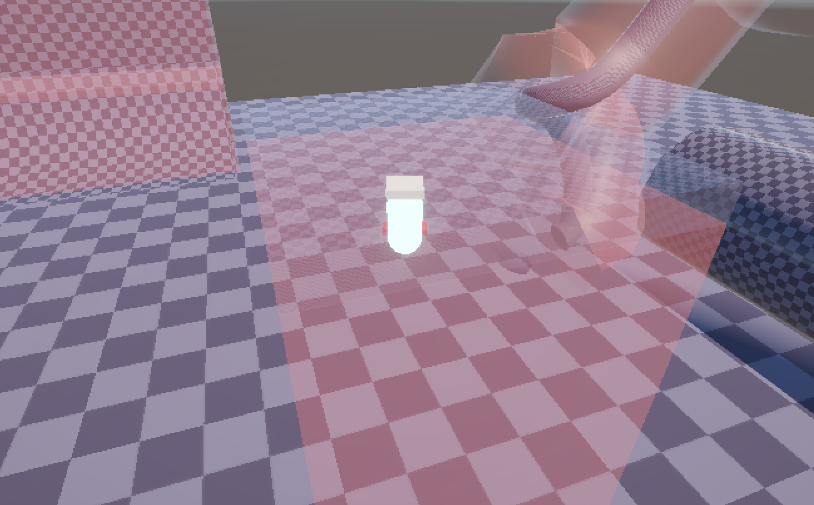

 ##Player Movement
  Admittedly, the player movement here is kinda crappy. You should replace it with movement code that suits the needs of your game, like more competent acceleration/deceleration values, a maximum speed, etc. It does, however, have the basics like a ground check for letting the player jump and code that sets "forward" as a direction dependent on both the gravity and the camera angle. Using weird trig stuff that I barely understand, this prevents the player from tunneling into the ground or rising into the air when you move. 
  Bottom line, use this code as a reference, but don't keep it as your base game's code. Nobody's gonna like that.
  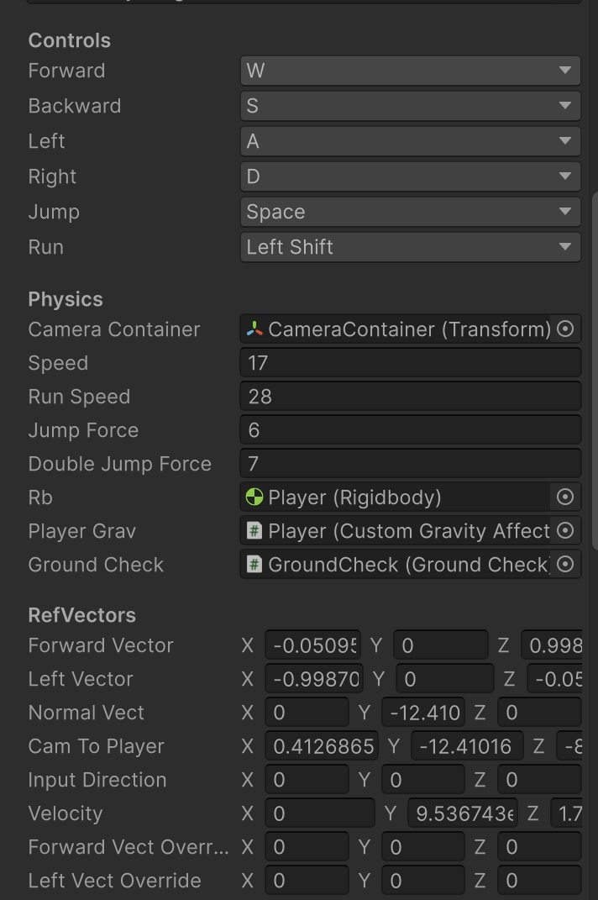
 
